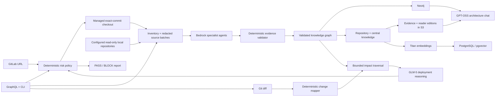

# AI Code Intelligence Platform

Evidence-grounded deployment intelligence for local and GitLab Node.js microservice
repositories. It runs as ordinary Python 3.12 and calls Amazon Bedrock Runtime
directly — there is **no Bedrock AgentCore dependency or integration**.

The configured Z.AI GLM-5 model performs semantic extraction and deployment
reasoning. Local code stays authoritative for repository inventory, source-line
evidence validation, exact cross-service identity matching, Git diff parsing,
graph traversal, and the final deployment gate.

## What it builds

- A versioned knowledge graph of the configured repositories
- Evidence and human-readable reader editions for every repository and the central architecture
- Grounded architecture chat through GPT-OSS 120B on Amazon Bedrock
- Titan embeddings behind an abstract vector-store interface
- Git change analysis and bounded transitive impact analysis
- Deployment reports with a deterministic `PASS`/`BLOCK` policy
- A GraphQL API and a CLI over the same application services
- Durable GitLab onboarding with queued, commit-aware portfolio refreshes
- Secure, read-only Jira Cloud/Data Center connections and repository-to-project mappings
- Neo4j, PostgreSQL/pgvector, and S3 persistence for application mode

## Requirements

- Python 3.12 (the project pins `>=3.12,<3.13`)
- [`uv`](https://docs.astral.sh/uv/) — recommended; pip works too
- AWS credentials permitted to invoke `zai.glm-5`, `openai.gpt-oss-120b-1:0`, and Titan Embeddings in the configured Region
- Optional: Docker, Neo4j, PostgreSQL with pgvector, an S3 bucket

## Quick start

```powershell
cd ai-code-intelligence-python
uv python install 3.12
uv sync --extra dev
Copy-Item .env.example .env
# Edit .env: set AWS_PROFILE, passwords, API key, and GitLab host/token if private.
uv run code-intel validate-config
uv run code-intel scan
```

The scan is read-only with respect to both Beelinks repositories. It does not
run package managers, edit files, or change their package versions.

## CLI

Every command takes `--config` / `-c` (default `config/default.yaml`).

| Command | Purpose |
|---|---|
| `validate-config` | Validate configuration and confirm repository paths exist. Makes no AWS calls. |
| `agents` | Print the specialist agent team as JSON. |
| `scan` | Inventory repositories, run the agents, and build the graph plus knowledge bases. |
| `analyze <repository-id>` | Refresh intelligence, analyze a Git change, and emit `PASS`/`BLOCK` reports. |
| `migrate` | Create PostgreSQL/pgvector schema objects idempotently. |
| `onboard <gitlab-url>` | Register a GitLab repository and return its queued portfolio-refresh job. |
| `migrate-local-to-gitlab --source ID,URL,REF ...` | Pre-clone and atomically convert existing local registrations, then queue one refresh. |
| `repositories` | List the durable repository portfolio. |
| `reindex` | Queue a commit-aware portfolio refresh. |
| `adopt-existing` | Validate/publish existing graph and Markdown without Bedrock. |
| `separate-internal-repository` | Move an already-published repository into the isolated Codex index without re-scanning. |
| `backfill-readers` | Add reader editions to the latest evidence manifest without scanning or invoking a model. |
| `worker` | Process onboarding/reindex jobs (`--once` is available). |
| `serve` | Run the GraphQL API. |

`scan` accepts `--persist-neo4j`, `--index-embeddings`, and `--persist-metadata`.
`analyze` accepts `--base`, `--head`, `--staged`, `--intent`,
`--use-neo4j-impact`, and `--persist-metadata`:

```powershell
uv run code-intel analyze email-service --intent "Add delivery retry handling"
uv run code-intel analyze socket-service --staged --intent "Change visitor presence event"
```

## GitLab onboarding application

The GraphQL mutation validates and registers the URL, then returns immediately. A worker materializes
every enabled GitLab source to resolve its exact commit, validates the current manifest and graph
baseline, and scans only new or changed repositories. Unchanged repository graph slices, knowledge
objects, and embedding partitions are reused. Cross-service links touching a changed repository are
recomputed only when their exact HTTP/socket/database input identities change. For an existing
repository, the worker parses the exact commit diff (added, modified, deleted, and renamed files),
maps changed lines to validated graph entities, expands through their dependency closure, and sends
only affected source files to the code agents. It patches affected graph file slices, repository
knowledge sections, and source embeddings. The central knowledge base is regenerated only when its
repository-summary or service/API/socket/database/business-rule evidence changes. If every commit still matches, the job completes without model calls,
Neo4j writes, embedding work, or S3 publication. An absent or inconsistent baseline safely falls
back to a full scan; package/module configuration changes and over-broad dependency closures also use
that fail-safe path.

Publication still produces one complete portfolio snapshot. Neo4j receives an exact transactional
node/relationship delta and advances one shared snapshot ID, affected embedding sources are patched atomically, repository
metadata is published as one catalogue operation, and the S3
`knowledge/latest.json` manifest remains the final visibility boundary.

GitLab remains the source-of-truth code store. The application does not upload complete repository
trees to S3: managed checkouts are local working data, while S3 contains immutable evidence and
reader-edition knowledge documents. If regulatory audit or disaster recovery later requires source
archives, add an opt-in, sanitized, KMS-encrypted object per commit under
`source-snapshots/<repository-id>/<commit>.tar.gz` plus a manifest pointer; never overwrite a shared
`latest` archive or include `.git`, environment files, credentials, generated output, or untracked
files.

```powershell
docker compose up --build
```

Open `http://127.0.0.1:4000`, sign in with the value of `CODE_INTEL_API_KEY`, and use the operations
console to register GitLab repositories, queue portfolio reindexes, inspect durable failure logs,
read either reader or evidence knowledge editions, configure Jira connections and project mappings,
and ask grounded architecture questions. S3 objects remain private;
the authenticated application reads and returns validated Markdown through same-origin endpoints.

Automation may continue to call `onboardRepository` at `http://127.0.0.1:4000/graphql` (see
[GraphQL API](docs/graphql-api.md)). Docker Compose runs PostgreSQL migration, API, and worker
services. For a non-container local run, `serve` embeds a single worker when the configured registry
driver is `local`.

Existing validated graph and Markdown artifacts can be adopted without another Bedrock scan using
`code-intel adopt-existing`. Run its `--validate-only` preflight first and keep the portfolio worker
stopped during publication. The command verifies every graph citation, preserves a matching Neo4j
snapshot, publishes deterministic S3 objects, records an `adopted-existing` PostgreSQL audit, and
writes `knowledge/latest.json` last. See [Setup and local execution](docs/setup.md#adopt-an-existing-graph-and-knowledge-base-no-bedrock).

The platform source code is deliberately outside the Beelinks portfolio. Its private Codex-facing
index has a separate Neo4j service, PostgreSQL schema, GraphQL port, graph/artifact volume, and local
knowledge store. It is never listed in the Beelinks central manifest or written to the active
Beelinks S3 knowledge prefix. See [Private Codex index](docs/internal-index.md).

Local bootstrap entries can be converted without changing their repository IDs or prior knowledge
pointers. Configure an allowlisted host and token, remove those repositories from the YAML bootstrap
list, then run one batch migration while the queue is idle:

```powershell
code-intel migrate-local-to-gitlab `
  --config config/container.yaml `
  --source "email-service,https://gitlab.example.com/team/email-service.git,main" `
  --source "socket-service,https://gitlab.example.com/team/socket-service.git,master"
```

Every URL/ref is cloned before the catalogue transaction. The command rejects plaintext HTTP,
credentials embedded in URLs, duplicate IDs/URLs, unknown repositories, and active indexing jobs.
It changes every requested source atomically and queues exactly one commit-aware portfolio refresh.

## Agent team

1. Repository Discovery
2. Code Graph
3. Code Graph Audit
4. Dependency Graph
5. Repository Knowledge
6. Central Knowledge
7. Architecture Chat (GPT-OSS 120B)
8. Deployment Risk

GLM-5 responses use Bedrock native JSON-schema output and are validated locally
with Pydantic. Large knowledge contexts use bounded, evidence-preserving
map/reduce stages. Every semantic graph fact
needs an exact supplied file, line range, source column, and a verbatim excerpt
occurring near the claimed line. Cross-repository links require exact static
REST, socket-event, or database identity.

## Deployment gate

Deterministic risk signals set a **floor** on the risk score that the model
cannot lower — `critical` → 100, `high` → 70, `medium` → 40. The final score is
`max(floor, model score)`.

A report is `BLOCK` when any of these hold:

- the configured deployment-risk model recommends blocking
- the implementation does not satisfy the stated intent
- the final risk score is 70 or higher
- impact traversal hit its safety bound (blast radius is incomplete)

When AI analysis fails and `analysis.fail_closed_on_ai_error` is enabled, the
gate returns an explicit `BLOCK` rather than guessing.

## Architecture



## Secrets and redaction

The platform loads its own ignored `.env` for local runtime configuration,
without overriding values already present in the process environment. Environment
files inside scanned repositories contribute variable **names** only — their values
are never read or sent to Bedrock. Source content is scanned for credential patterns (assignments,
quoted literals, AWS access keys, bearer tokens, URI passwords) and redacted
before it reaches a prompt, an embedding, or a persisted report.

Secrets are read from the environment by name, never from YAML:
`NEO4J_PASSWORD`, `POSTGRES_URL`, `S3_BUCKET`, `GITLAB_TOKEN`, `CODE_INTEL_API_KEY`, and the
optional `BEDROCK_GUARDRAIL_ID` / `BEDROCK_GUARDRAIL_VERSION`.
The optional `NEO4J_INTERNAL_PASSWORD` and `CODE_INTEL_INTERNAL_API_KEY` provide distinct credentials
for the localhost-only Codex index; when omitted in Compose they inherit their corresponding main
credential rather than introducing another default secret.

`BEDROCK_CHAT_MODEL_ID` independently configures the architecture-chat model and defaults to
`openai.gpt-oss-120b-1:0`. Chat reads the latest published reader editions and the exact Neo4j
snapshot named by the same manifest. It selects bounded document sections plus a bounded one-hop
graph neighborhood; document facts use `S` citations and Neo4j facts use separately validated `G`
citations. A missing, mismatched, or unavailable graph degrades safely to reader-edition retrieval.

GitLab onboarding accepts only HTTPS URLs on the exact configured hostname allowlist. Tokens are
read from the environment, passed through a temporary askpass helper, and never stored in the URL,
catalog, subprocess arguments, GraphQL response, or knowledge base.

Jira configuration follows the same secret-indirection boundary. The frontend and GraphQL API store
only an allowlisted HTTPS base URL, edition, username (Jira Cloud only), and the **name** of a
credential environment variable. Jira Cloud uses email/API-token authentication; Jira Data Center
uses a bearer personal access token. The token value is read only when the server performs a
read-only connection test or issue lookup and is never returned to the browser or persisted in
PostgreSQL/local configuration. See [Setup and local execution](docs/setup.md#jira-configuration).

The browser exchanges the API key for a short-lived signed `HttpOnly`, `SameSite=Strict` session;
the key is not stored in browser storage. Browser GraphQL writes also require a session-bound CSRF
token. Use HTTPS outside localhost so the session cookie is marked `Secure`, and configure a long,
random `CODE_INTEL_API_KEY`.

## Development

```powershell
uv run ruff check .
uv run ruff format --check .
uv run mypy
uv run pytest
```

`mypy` runs in strict mode and `ruff` enforces the lint set declared in
[pyproject.toml](pyproject.toml).

## Documentation

- [Setup and local execution](docs/setup.md)
- [Architecture](docs/architecture.md)
- [AWS configuration](docs/aws-setup.md)
- [Folder structure](docs/folder-structure.md)
- [Database schema](docs/database-schema.md)
- [Neo4j model and Cypher](docs/neo4j-model.md)
- [GraphQL API](docs/graphql-api.md)
- [Private Codex index](docs/internal-index.md)
- [Example deployment output](docs/example-output.md)
- [GitLab and Jira roadmap](docs/roadmap.md)
