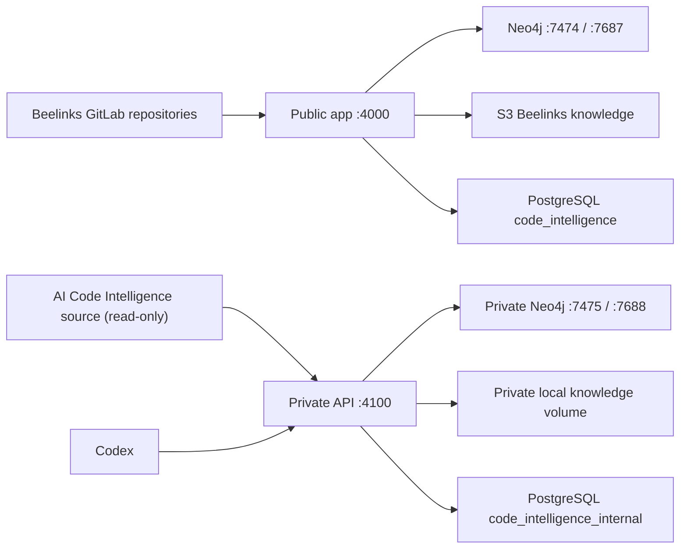
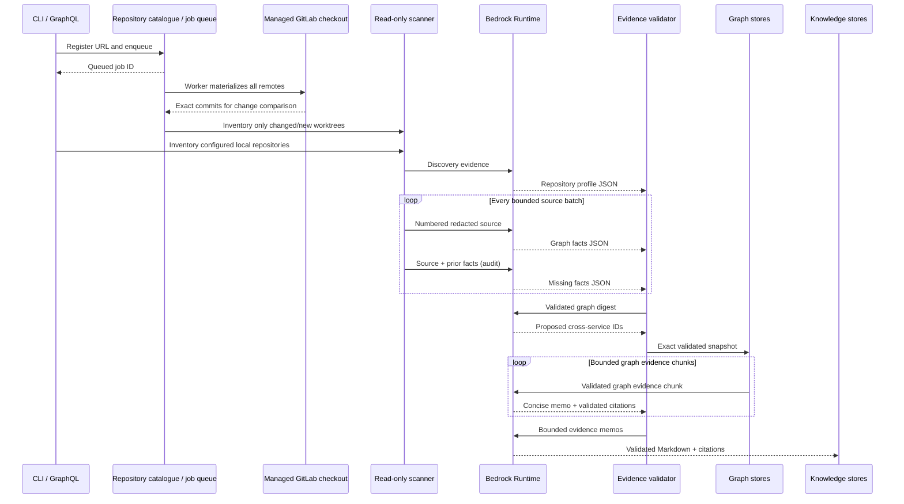

# Architecture

## Design principles

- Bedrock performs semantic code understanding; the local scanner only inventories and transports source evidence.
- Model output is a proposal. Pydantic validation, source-line verification, exact identity checks, and graph traversal decide what becomes truth.
- Environment files in scanned repositories contribute names only. Their values are never sent to Bedrock.
- Repository mounts are read-only in Docker, and no workflow runs npm or edits target repositories.
- Infrastructure is behind ports so local Git can become GitLab, PostgreSQL can be supplemented by another vector store, and S3 can be replaced in tests.
- AgentCore is deliberately absent. The service calls Bedrock Runtime from standard Python 3.12.
- GLM-5 uses native Bedrock JSON-schema output; Pydantic and evidence validation remain authoritative.
- GPT-OSS 120B answers architecture questions from bounded published reader-edition excerpts and
  may cite only source labels supplied to that invocation.
- GitLab requests are queued durably; long Bedrock work never holds a GraphQL request open.
- Jira endpoints are exact-host allowlisted and read-only; stored connection records reference an
  environment-variable name instead of containing a credential.
- A refresh resolves every GitLab commit, analyzes only changed/new repositories when the published
  baseline is reusable, and still publishes one complete graph/knowledge system snapshot.
- The platform's own source index is a separate operational domain. It has its own Neo4j instance,
  PostgreSQL schema, local knowledge/artifact volume, API port, and manifest; it cannot become a
  Beelinks central-knowledge member through YAML bootstrap configuration.

## Portfolio isolation

The services share only the PostgreSQL server process and application image. Schema, graph,
knowledge publication, API credentials, network ports, and artifact volumes remain distinct. The
internal API binds to `127.0.0.1`; its index is not an input to public central-knowledge generation.

## Layer map

| Layer | Python modules | Responsibility |
|---|---|---|
| Inventory | `scanner/`, `agents/content.py` | Files, directories, manifests, env names, safe redacted batches |
| Semantic extraction | `agents/specialists.py` | Repository profile and semantic entities/relationships |
| Evidence authority | `agents/assembler.py`, `agents/dependency.py` | Source verification and exact cross-service identity |
| Graph | `graph/` | Stable IDs, snapshot, Neo4j |
| Knowledge | `knowledge/` | Evidence/reader Markdown, grounded chat retrieval, and object storage |
| Embeddings | `embeddings/` | Titan, chunking, pgvector abstraction |
| Changes | `git/` | Local Git abstraction, unified diff, changed entity mapping |
| Repository sources | `git/gitlab_checkout.py`, `persistence/*catalog.py` | Allowlisted checkout, exact commits, durable catalogue/jobs |
| Requirements integration | `jira/` | Read-only Jira Cloud/Data Center clients, secret-free connection metadata, repository/project mappings |
| Impact | `analysis/impact.py` | Bounded relationship-aware traversal |
| AI safety reasoning | `analysis/deployment_agent.py` | Intent, regression, side-effect analysis |
| Deployment gate | `reports/` | Deterministic score floor and PASS/BLOCK |
| Transport | `api/`, `api/static/`, `cli.py` | Secure browser console, thin GraphQL, knowledge reads, and CLI adapters |
| Composition | `application/` | Use-case orchestration and dependency wiring |

## Agent sequence

## Trust boundaries

1. Source and documentation are untrusted prompt content.
2. Model responses are untrusted until schema and evidence validation pass.
3. Structural filesystem facts are produced locally.
4. Semantic facts are admitted only when their claimed excerpt occurs near the exact claimed source line supplied to that invocation.
5. The model cannot create cross-repository IDs. It may reference existing IDs, and exact deterministic rules approve or reject them.
6. AI risk reasoning cannot expand affected service, endpoint, or test IDs beyond deterministic impact results.
7. Critical/high deterministic signals establish risk-score floors; GLM-5 cannot lower them.
8. Reader editions only remove internal citation markers; they do not rewrite claims. Architecture
   chat treats every document excerpt and user turn as untrusted content and validates citations.
9. Jira base URLs must use HTTPS and match an exact configured hostname. Credentials are resolved
   lazily from the environment and never cross the GraphQL/browser or persistence boundaries.

Knowledge generation uses bounded map/reduce over a compact graph digest that preserves every citable node and
relationship ID, relationship direction, source location, qualified name, and business metadata.
Duplicated source excerpts, hashes, extraction labels, and batch bookkeeping are omitted. The
configured context ceiling remains enforced, and graph evidence is neither silently truncated nor
submitted as one oversized model request. Intermediate memos may cite only IDs present in their
specific chunk; final documents may cite only the union of validated memo evidence.
Inline knowledge citations are deterministically reconciled with the response evidence arrays only
after every cited ID is verified against the authoritative graph. Omitted ID namespaces are restored.
An ellipsized node citation is repaired only when an adjacent exact entity name maps unambiguously to
a graph node already present in the validated evidence array; other unknown citations still fail closed.
A missing leading hash character is repaired only when at least 20 supplied hash characters uniquely
suffix-match one authoritative graph ID; the same rule normalizes response evidence arrays.

## Repository onboarding and publication

YAML entries bootstrap trusted local repositories. Runtime GitLab repositories are registered through
GraphQL or `code-intel onboard`; callers cannot supply a filesystem path or credential. The managed
checkout adapter accepts only exact allowlisted HTTPS hosts, disables hooks/submodules/LFS smudge,
uses argument-vector subprocesses, and checks out a detached exact commit.

One worker claims the oldest job and materializes every enabled repository so the remote ref resolves
to an exact commit. It compares those commits with indexed catalogue metadata and verifies that each
candidate for reuse exists in the current S3 manifest and local graph snapshot. New repositories use
a full scan. For a previously proven exact commit, the Git change-set resolver detects added,
modified, deleted, and renamed files. Changed source lines seed prior graph entities; bidirectional
semantic traversal expands the seed to its bounded dependency closure. Entire affected files are
reanalyzed so shifted locations and all facts in each touched file are refreshed.

The graph patcher rebuilds the complete deterministic repository inventory, removes invalidated old
file facts and evidence, merges the affected semantic fragments, rejects stale paths/dangling edges,
and produces one complete in-memory graph. It never exposes partial Neo4j state. Repository Markdown
generation replaces only invalidated level-two sections and deterministically retains valid sections;
stale citations force a safe full-document regeneration. pgvector changes are scoped to affected
source URIs and changed knowledge documents. Exact dependency-agent inputs and the central
architecture projection are fingerprinted, so cross-service linking and central Bedrock generation
are skipped when their facts did not change. Missing commits, package/TypeScript configuration
changes, excessive closure size, or inconsistent publication evidence cause a full repository/portfolio
fallback rather than risking stale facts.

The merged result is nevertheless a complete portfolio snapshot. Neo4j applies only added, changed,
relabelled, and deleted graph records in one transaction and atomically advances the shared snapshot
ID. Changed repository plus central embedding scopes are atomically replaced, catalogue index metadata is
published in one operation, and `knowledge/latest.json` is the final S3 visibility boundary. GraphQL
reads survive API restarts by hydrating the local graph snapshot with Neo4j fallback.

Each evidence document produces a deterministic reader edition that hides raw Neo4j node and
relationship identifiers while preserving the original prose. Both editions are published in one
manifest. GPT-OSS chat loads that latest manifest, ranks Markdown sections locally, and retrieves a
bounded one-hop Neo4j neighborhood from the exact snapshot named by the manifest. Bedrock receives
human-readable graph facts without hidden graph IDs alongside the selected excerpts. `S` document
citations and `G` graph citations are independently allowlisted, and a graph citation is mandatory
when graph evidence is supplied. Neo4j failure or an empty/mismatched snapshot falls back to the
published reader editions. PostgreSQL job events provide a sanitized durable timeline; raw tracebacks
stay in worker logs.

The separate legacy-adoption use case publishes previously validated graph and Markdown artifacts
without using Bedrock or Titan. It requires an idle queue, exact graph/repository/document coverage,
and resolvable inline graph citations. A matching Neo4j graph is read and preserved; empty or
different Neo4j state is rejected unless the operator explicitly supplies `--replace-neo4j` after
preflight review. The graph is also copied into the application artifact volume so API/deployment
reads never depend on an ephemeral read-only import mount. Publication uses deterministic artifact
IDs and an `adopted-existing` PostgreSQL scan audit. Versioned documents, recoverable catalogue
metadata, and graph state are prepared before S3 `latest.json`, which remains the final visibility
boundary. Rollback restores the prior catalogue, local graph, Neo4j content, and manifest pointer;
unreferenced versioned objects and idempotent audit rows are safe to retain.

The web console is served by the same FastAPI origin. An API key is exchanged for a bounded,
HMAC-signed `HttpOnly` session, browser GraphQL requests are CSRF-bound, and restrictive response
headers prevent framing or external script/style execution. Knowledge Markdown is fetched from S3
server-side only after manifest, bucket, prefix, repository, and catalogue validation.

The same console exposes Jira configuration. In Docker/PostgreSQL mode, connection metadata and
repository mappings are durable relational records; local mode uses an atomic JSON file. A
connection stores its edition, credential-free HTTPS base URL, optional Cloud email, and credential
environment-variable name. A read-only client resolves the secret only for a bounded request, uses
Cloud REST v3 Basic authentication or Data Center REST v2 bearer authentication, validates TLS, and
does not follow redirects. Jira-derived deployment intent is not yet part of the scan/deployment
pipeline; that integration remains explicitly staged in the roadmap.

```mermaid
flowchart LR
    A["GitLab URL"] --> B["GraphQL validation"]
    B --> C["PostgreSQL repository + queued job"]
    C --> D["Single portfolio worker"]
    D --> E["Managed exact-commit checkouts"]
    E --> F["Commit comparison + baseline validation"]
    F --> S["Changed/new repository analysis"]
    F --> U["Reusable repository artifacts"]
    S --> G["Merged validated graph"]
    U --> G
    G --> H["Transactional Neo4j delta"]
    G --> I["Repository knowledge bases"]
    I --> J["Central knowledge base"]
    J --> R["Deterministic reader editions"]
    R --> K["S3 latest manifest"]
    K --> L["Grounded GPT-OSS chat"]
```

